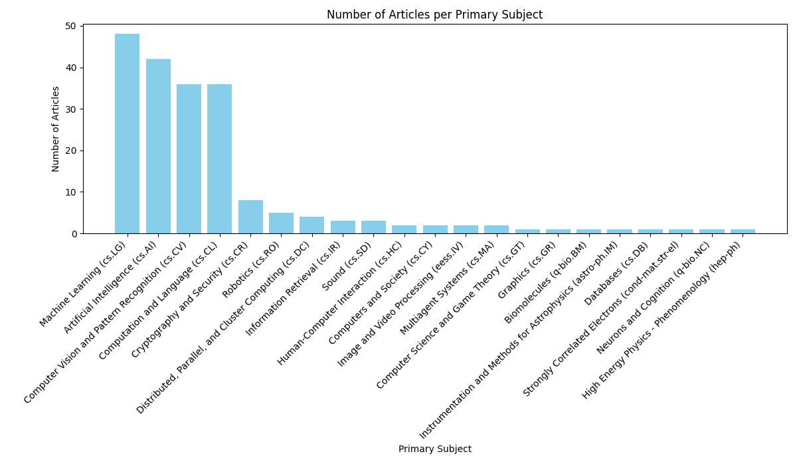
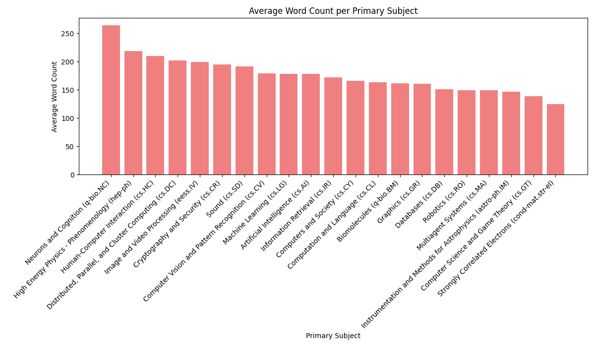
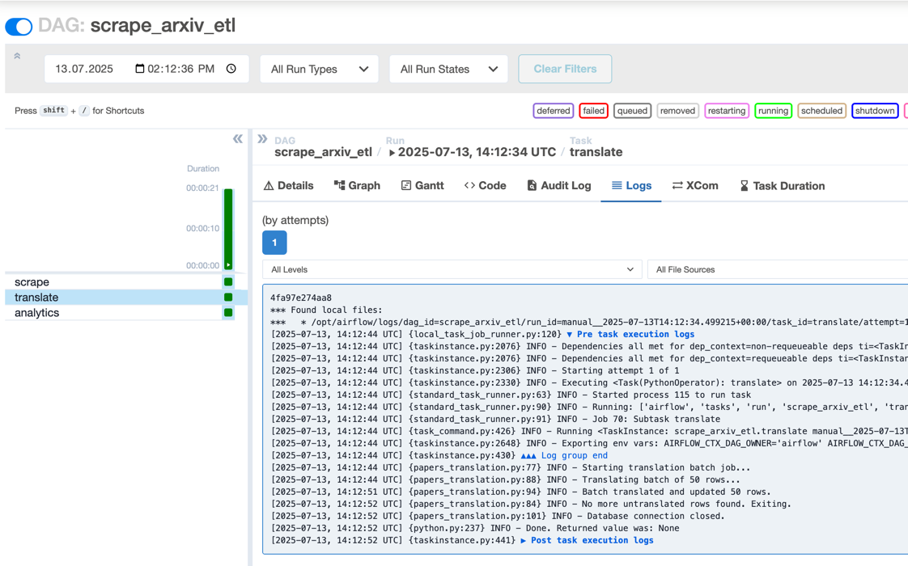

# Arxiv Scraper ETL Project

## Overview

This project is an ETL pipeline for scraping Arxiv data using Scrapy inside an Airflow-managed dev environment with Docker.

- The Scrapy project is inside the `arxiv_scraper` directory.
- Docker containers run Airflow services and a PostgreSQL database.
- PostgreSQL stores scraped data.
- DAG is scheduled to be run daily
- Every process is well-documented and handling errors

---

## Scraping process
- **It's very important to first check robots.txt of the website that is being planned to scrape - for instance, in the arxiv.org case, they kindly ask to make 1 request each 15 seconds for each paper, to make sure it's not a spam and you will not be blocked for that (can be resolved by rotating proxies and headers)**
- I've decided to scrap daily updates of cs.AI category from the https://arxiv.org website.
- Inside the created spider, it makes the request to the https://arxiv.org/list/cs.AI/new?skip=0&show=2000 (hardcoded just for testing purposes)
- The [spider](arxiv_scraper/arxiv_scraper/spiders/arxivspider.py) fetches all the needed data (arxiv id, title, abstract, authors, primary subject, paper url, pdf url)
- In the [pipelines](arxiv_scraper/arxiv_scraper/pipelines.py) I'm making initial checks and adding the word count for the abstracts, then saving the **structured data* to PostgreSQL

## DAG

1. Scraping data from the arxiv.org daily data (It can be adjusted to all categories but I concentrated on only one)
2. Scraped data stored inside PostgreSQL
3. Running script to translate abstract to Ukrainian using DeepL API in batches.
4. Running transformations using Polars and visualization using matplotlib


## How I would adjust this process if it was cloud prod environment (GCP)

1. Each scraper for each resource should be isolated inside the Docker container and being pushed to Artifact Registry to be ran via Cloud Run (cheap and fast solution) or inside Cloud Composer
2. After scraping, we're loading the data to GCS .parquet files -> Cloud Functions to upload data to DWH (if needed)
3. If data is in DWH, reports are being formed either using DBT (poor Airflow integration) or Dataform (GCP managed, perfect for BigQuery)
4. If data is in OLTP and we need to store transformations there - Use polars + Matplotlib (Not the best)
5. If something happens during the pipeline - we can set email or slack notifications so Analysts/Engineers will know exactly in time


## Analytics

The result of scraped data with translation is being pushed to repository in csv format - [Arxiv papers table translated](arxiv_papers_table_example.csv)





Additionally, a screenshot from dev environment Airflow run of a DAG




## 🚀 Quickstart

1. Clone the repo - ```git clone git@github.com:Se7enquick/boosters-tt.git```
2. Create virtual environment using ```virtualenv .venv```
3. Install the dependencies - ```poetry install```
4. Fill in the envs for local development using [.env.example](.env.example)
5. Make sure to adjust [docker-compose-dev.yaml](docker-compose-dev.yaml) if you find that some of the ports may be in use on your local system
6. Run the process - ```make build-dev```
7. You can access local Airflow instance - http://0.0.0.0:8081/
8. Trigger DAGS, view schedules, jobs